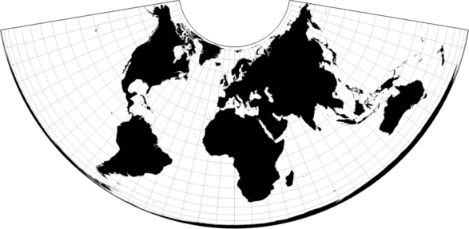
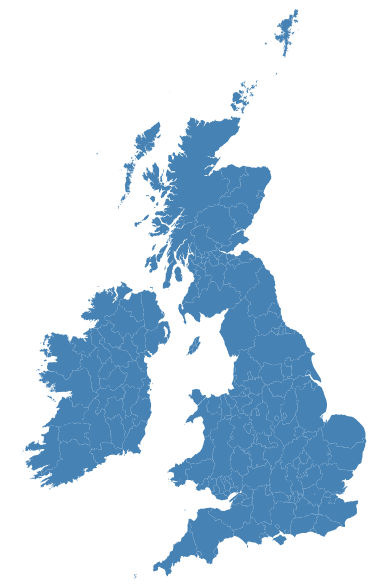

# Explore  

In this Explore section issues with visualisation of Open Street Map (OSM) geography data are considered. The `example.sh` script contains all the following steps

## First Visualisation

In the first visualisation simplify the area data

```
    $ geo2topo counties=output/geo-multipolygons.json | \
        toposimplify -p 1E-5 -f | \
        topo2geo counties=- > visualisation/geo-multipolygons-simplified.json
```

Add tags for the visualisation and convert the new-line delimited, *ndjson*, format file to *GeoJSON*:

```
    $ < output/geo-multipolygons-simplified.ndjson | \
            ndjson-map 'd.id = d.properties.name, d.properties.county = d.properties.name, d' | \
            > output/british-isles.ndjson
```

This is then rendered in the `example01.html` using the using the `d3.geoConicEqualArea()` projection [here](https://github.com/d3/d3-geo/blob/master/README.md#geoConicEqualArea). The whole world projection example below:



Viewing a local web-server and browsing to the `example01.html` file to scale, fill and view the image

```
    $ python -m http.server 8080&
```

Which produces the following showing a *global* visualisation for a map of the UK


After investigation this is due to the winding order of the OSM data 

## What is Winding-Order: Inside or Out? 

The GeoJSON specification RFC7946 [here](https://tools.ietf.org/html/rfc7946#section-3.1.6) defines whether a point is inside or outside a given-polygon is based on the **winding order** of the exterior:

```
3.1.6. Polygon
To specify a constraint specific to Polygons, it is useful to
   introduce the concept of a linear ring:

   -  A linear ring is a closed LineString with four or more positions.

   -  The first and last positions are equivalent, and they MUST contain
      identical values; their representation SHOULD also be identical.

   -  A linear ring is the boundary of a surface or the boundary of a
      hole in a surface.

   -  A linear ring MUST follow the right-hand rule with respect to the
      area it bounds, i.e., exterior rings are counterclockwise, and
      holes are clockwise.
```

## Second Visualisation

In the second visualisation the `rewind.js` script is applied to the data

```
   $ visualisation/geo-simplified.json ./rewind.js > visualisation/geo-rewind.json
```

As above, this is then rendered using the using the `d3.geoConicEqualArea()` projection in the `example02.html`. Viewing a local web-server and browsing to the `example01.html` file to scale, fill and view the image

This produces the following showing a filled visualisation for a map of the UK




## The `rewind.js` script

The `rewind.js` script iterates through elements that make up the Polygon and MultiPolygon, calculates the area of the `polygon` using the `d3.geoArea()` function and if the area is greater than 2&#960;, reverse the winding order

```
   if (d3.geoArea(polygon) > 2 * Math.PI) {
       coordinate.forEach(function(ring) {
           ring.reverse();
       })
   }
```
